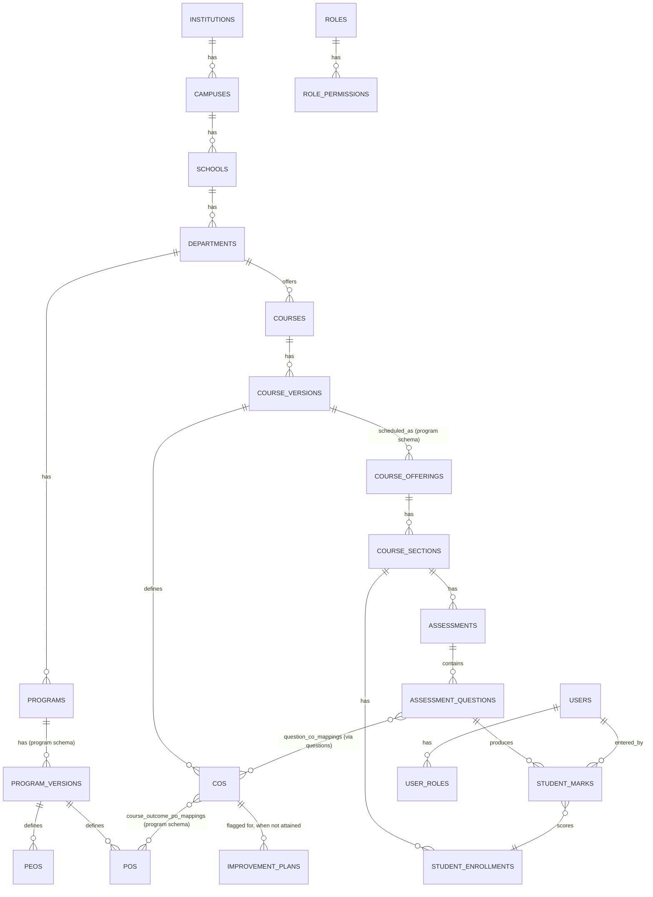
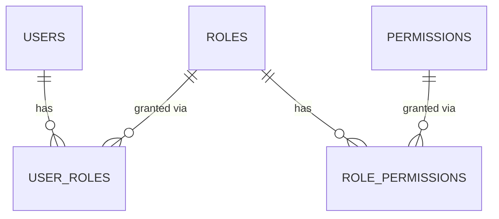

# OBEvolve — Database Plan

PostgreSQL 16. UUID primary keys everywhere. Two-tier multi-tenancy —
schema-per-institution ([ADR 0001](adr/0001-schema-per-tenant.md)) with
schema-per-program nested inside it
([ADR 0003](adr/0003-schema-per-program.md)); see
[ARCHITECTURE.md](ARCHITECTURE.md) §2 for the mechanism.

Every table below is marked with which physical schema it lives in:
- **[institution]** — `tenant_<slug>`, shared across every program in that
  institution.
- **[program]** — `tenant_<slug>__<program_code>`, one copy per program.
- **[public]** — the cross-tenant control-plane schema.

This split (not "Phase N implements table X") is now the load-bearing fact
about where a table lives — get it wrong and a query 500s with
`UndefinedTable`, not a logic bug. Status markers (implemented vs. planned)
are kept per table for what's still ahead of the current build.

Conventions used throughout:
- `id UUID PK default gen_random_uuid()`
- `created_at timestamptz default now()`, `updated_at timestamptz` (auto-touched)
- Workflow status columns use one shared enum:
  `draft | submitted | reviewed | approved | published | archived`
- Mapping/weight scores use a configurable scale (see `mapping_scales`), default
  `0=None,1=Low,2=Medium,3=High`
- Soft-delete (`is_active boolean`) only on org/catalog entities that can be
  deactivated; assessment/academic records that feed accreditation are never
  deleted, only superseded by new versions.

---

## 0. Control plane [public] (implemented)

### `institutions`
Tenant registry — the only table every request needs before tenant resolution.

| column | type | notes |
|---|---|---|
| id | uuid PK | |
| name | text | |
| code | text unique | institutional short code |
| slug | text unique | used for subdomain / `X-Institution-Slug` |
| schema_name | text unique | `tenant_<slug>` |
| status | text | `active \| suspended \| trial` |
| subscription_plan | text | |
| contact_email | text | |
| logo_url | text nullable | |
| timezone | text | default `UTC` |
| created_at / updated_at | timestamptz | |

### `platform_admins`
Super Administrator accounts — the only role that spans institutions.

| column | type | notes |
|---|---|---|
| id | uuid PK | |
| email | text unique | |
| password_hash | text | |
| full_name | text | |
| mfa_secret | text nullable | MFA-ready, not enforced yet |
| is_active | boolean | |
| created_at | timestamptz | |

---

## A. Organizational structure (implemented)

`institutions → campuses → schools → departments → programs`, then
`programs → program_versions` (which crosses into the program schema — see
below), plus the academic calendar (`academic_years → academic_terms`).

### `campuses` [institution]
`id, institution_id[FK public.institutions], name, code, address, is_active, created_at, updated_at`
*(institution_id is the one cross-schema FK — tenant schema → public schema.)*

### `schools` [institution]
`id, campus_id[FK], name, code, is_active, created_at, updated_at`

### `departments` [institution]
`id, school_id[FK], name, code, is_active, created_at, updated_at`

### `programs` [institution]
`id, department_id[FK], name, code, degree_level, is_active, created_at, updated_at`

The program *registry* row only — stays institution-shared so the raw-data
console, the program switcher, and role-scoping (`user_roles.scope_type=
"program"`) can all resolve a program without needing program-schema
access first. Creating a row here triggers
`provision_program_schema()` ([ADR 0003](adr/0003-schema-per-program.md)),
which creates and migrates that program's own schema.

### `program_versions` [program]
`id, program_id[FK public.programs — resolved via the institution-shared
translate-map key from inside the program schema], version_label,
effective_academic_year_id[FK], status(workflow), created_by[FK users],
approved_by[FK users], created_at, updated_at`

Historical program versions are never edited after `published`; a new
curriculum change creates a new `program_version` row (spec §6, §10) — and
because everything downstream (PEOs, POs, mappings) hangs off a specific
`program_version_id`, recalculating attainment today never changes what an
already-published prior version meant.

### `academic_years` [institution]
`id, label, start_date, end_date, is_active`

### `academic_terms` [institution]
`id, academic_year_id[FK], name, term_type, start_date, end_date, is_active`

---

## B. Identity & RBAC (implemented)

### `users` [institution]
`id, email unique, password_hash, full_name, is_active, mfa_enabled, bio nullable, last_login_at, created_at, updated_at`

### `roles` [institution]
`id, name, description, is_active`  — seeded with a default set (several
seeded `is_active=False` — disabled rather than removed, for a simpler
assignable-roles list out of the box); institution admins may add custom
roles or re-enable a disabled one.

### `permissions` [institution]
`id, code unique` (e.g. `curriculum.view`, `assessment.approve`, `marks.enter`,
`attainment.calculate`, `raw_data.manage_scoped`), `description, module` —
the fixed catalogue lives in code (`app/core/permissions.py`), seeded once
per tenant, never edited per-institution.

### `role_permissions` [institution]
`role_id[FK], permission_id[FK]` — composite PK.

### `user_roles` [institution]
`id, user_id[FK], role_id[FK], scope_type nullable`
(`app.models.tenant.identity.ScopeType`: `institution|campus|school|
department|program|course` — `null`/`institution` both mean unscoped),
`scope_id nullable` — lets "Program Coordinator" be scoped to one program,
"Course Administrator" to one course. Real and UI-assignable (Institute
Settings → Users & roles), not just a schema field: `scope_type="program"`
grants are what `get_program_context` checks before letting a request touch
that program's schema at all ([ADR 0003](adr/0003-schema-per-program.md)).

### `faculty_profiles` [institution]
`user_id[FK PK], employee_code, designation, department_id[FK]`

### `student_profiles` [institution]
`user_id[FK PK], student_code, program_id[FK], program_version_id[UUID, no
DB-level FK], batch_year, status`

`program_version_id` is a plain UUID with **no** foreign-key constraint —
`program_versions` now lives in a per-program schema, and a single FK
column can only target one fixed schema, so once a second program exists a
real constraint here would be unsound. Referential integrity for this
column is enforced at the application layer instead (same reasoning as
`GradingPolicy.program_version_id` below). `batch_year` doubles as the
attainment engine's cohort key (§H) — there is no separate `Cohort` entity.

---

## C. Courses (implemented — catalog, delivery, grading policy)

Course *catalog* (`courses`/`course_versions`) stays institution-shared so a
course can be co-offered across programs. Course *delivery/scheduling* —
offerings, sections, faculty assignments, enrollments — is program-specific;
`course_prerequisites` alone stays planned — no source data for it yet.

### `courses` [institution]
`id, department_id[FK], code, title, description nullable, credits(numeric,
keeps source formatting like "1" or "3.0"), contact_hours nullable,
course_type nullable (category label as published, e.g. "Major Core" — not
a constrained enum, since institutions vary), co_offered_with_id[FK courses,
nullable, self-referential, ON DELETE SET NULL], is_active`

`co_offered_with_id` is a single, one-directional link ("this course is also
offered as/with that course"), not a many-to-many junction — the source
curricula model co-offering as a single pair, not a network of more than
two; revisit if that need actually comes up.

### `course_versions` [institution]
`id, course_id[FK], version_label (e.g. "2022"), effective_academic_year_id[FK
nullable — curriculum year may predate the academic_years seeded for a fresh
tenant], status(workflow), created_by[FK nullable], approved_by[FK nullable]`

### `course_prerequisites` (still planned)
Unchanged from the original proposal — no source data for it yet.

### `course_offerings` / `course_sections` / `faculty_assignments` / `student_enrollments` [program] (implemented)
Course delivery/scheduling, per-term operational data (distinct from the
institution-shared catalog above):

`course_offerings(id, course_version_id[FK institution-shared course_versions],
academic_term_id[FK institution-shared academic_terms],
program_version_id[FK program.program_versions, nullable — the same
offering can serve multiple programs' students])`

`course_sections(id, course_offering_id[FK program.course_offerings], section_code, max_students nullable)`

`faculty_assignments(id, course_section_id[FK program.course_sections],
faculty_user_id[FK institution-shared users], role — "coordinator"|
"instructor", free string, not an enum table)`

`student_enrollments(id, student_user_id[FK institution-shared users],
course_section_id[FK program.course_sections], enrollment_status(default
"enrolled" — free string: `enrolled|completed|withdrawn|incomplete|failed`),
enrolled_at)`

`enrollment_status` values `withdrawn`/`incomplete` are what the attainment
engine's `wi_treatment` setting (§H) acts on.

### Grading policy [institution] (implemented)
Letter-grade bands used to convert a percentage into a grade + grade point.
Institution-wide, not per-program (spec §7 asked for one policy per
institution, not per-curriculum):

`grading_policies(id, name, program_version_id[UUID, no DB-level FK — see
`student_profiles` above for why; an institution-wide default policy has
this null], is_default, description nullable)`

`grading_bands(id, grading_policy_id[FK], letter_grade (e.g. "A", "A-", "B+"),
min_percentage, max_percentage, grade_point nullable, sequence)` — the
non-numeric administrative grades (I/W/AW) are encoded with a sentinel
`min_percentage = max_percentage = -1.00` rather than a separate column,
since they're still one row in the same ordered band list the UI renders.

---

## D. OBE outcome hierarchy (implemented, framework-aware)

An explicit accreditation-framework layer, per
[ADR 0002](adr/0002-framework-aware-outcomes.md): an outcome's *framework*
definition (BAETE's official PO wording) and a program's *adopted*
definition (what a specific program actually publishes, which may use
older/different wording) are separate rows, optionally linked — never
merged or overwritten. **Naming convention**: outcome codes are `CO#`
(Course Outcome) and `PO#` (Program Outcome) throughout the UI and seeded
data — not `CLO#`/`PSO#` as an earlier pass used; existing data was
migrated to this convention, and it is what any new seed/import should
produce.

### `bloom_levels` [institution]
`id, name, sequence_order, is_active` — configurable per institution, seeded with
the 6 default levels (Remember → Create).

### `accreditation_bodies` [institution] (implemented)
`id, name (e.g. "Board of Accreditation for Engineering and Technical
Education"), code (e.g. "BAETE"), description nullable, is_active`

### `accreditation_frameworks` [institution] (implemented)
`id, accreditation_body_id[FK], name (e.g. "BAETE Accreditation Manual"),
version (e.g. "v3.0"), effective_date, expiry_date nullable, description
nullable, is_active`

### `framework_pos` [institution] (implemented)
The framework's own official PO catalogue — e.g. BAETE v3.0's PO1–PO12, verbatim.
`id, framework_id[FK], code, statement, sequence, is_active`

### `knowledge_profiles` (WK) / `problem_attributes` (WP) / `engineering_activities` (EA) [institution] (implemented)
Same shape for all three: `id, framework_id[FK], code, title nullable
(short label, e.g. WP's "Depth of knowledge required"), description, sequence,
is_active`. Seeded from BAETE v3.0 Tables 6.1/6.2/6.3 (WK1–9, WP1–7, EA1–5).

### `peos` [program] (implemented)
`id, program_version_id[FK program.program_versions], code, statement,
description nullable, sequence, is_active, status(workflow), effective_from
nullable, effective_to nullable, created_by[FK institution-shared users
nullable], approved_by[FK nullable]`

### `program_outcomes` [program] (implemented)
The program's *adopted* POs — what the program actually publishes and assesses
against, which may differ in wording from the framework.
`id, program_version_id[FK program.program_versions],
framework_po_id[FK institution-shared framework_pos, NULLABLE], code,
title nullable (short label, e.g. "Engineering Knowledge"), statement, sequence,
is_active, status(workflow), effective_from nullable, effective_to nullable`

`framework_po_id` is set when a program PO is explicitly derived from a
framework PO (by outcome "slot," not by text match — e.g. ULAB's PO1 links to
BAETE v3.0's PO1 despite different wording); it stays `NULL` when a program PO
has no framework counterpart. This is the concrete mechanism for
[ADR 0002](adr/0002-framework-aware-outcomes.md): never assume framework
wording and program wording are the same string, but keep them traceable to
each other.

### `psos` (still planned — not used by the ULAB CSE seed, kept for programs that need them)

### `course_outcomes` [institution] (implemented)
`id, course_version_id[FK], code (convention: "CO1".."CO5" — see naming note
above), statement, sequence, bloom_target_level_id[FK bloom_levels,
nullable], is_active, status(workflow)`

Stays institution-shared (like `course_versions`) rather than moving into
the program schema — a CO belongs to the course catalog, and a co-offered
course's COs need to be referenceable from whichever program(s) offer it.
`course_outcome_po_mappings` (§E) is what's actually program-specific: the
same CO can, in principle, be mapped to different programs' POs.

### `tlos` / `competencies` / `performance_indicators` (still planned)
Unchanged — spec §16 explicitly defers PO indicators; no TLO/competency source
data exists yet either.

---

## E. Mappings [program] (implemented)

All normalized junction tables — **never** comma-separated strings or JSON
blobs (spec §7). Program-specific (a CO-PO or PEO-PO mapping is one
program's judgment call, even when the CO/framework side is shared), so
these live in the program schema.

| table | columns | status |
|---|---|---|
| `course_outcome_po_mappings` | course_outcome_id[FK], program_outcome_id[FK], mapping_scale_level_id[FK], remarks nullable | implemented, empty |
| `program_outcome_peo_mappings` | program_outcome_id[FK], peo_id[FK], mapping_scale_level_id[FK], remarks nullable | implemented, empty |
| `po_pso_mappings` | po_id[FK], pso_id[FK], level(int) | still planned |
| `tlo_co_mappings` | tlo_id[FK], co_id[FK], level(int) | still planned |
| `competency_pi_mappings` | competency_id[FK], performance_indicator_id[FK], level(int) | still planned |

### `mapping_scales` / `mapping_scale_levels` (implemented — supersedes the single-table sketch)
Correlation scales are institution-configurable in both how many levels exist
and what they're called (spec §14: binary Yes/No, ternary None/Low/High,
four-level None/Low/Medium/High, etc.), so they're two tables, not one fixed set
of rows:
`mapping_scales(id, name, description nullable, is_default)`
`mapping_scale_levels(id, mapping_scale_id[FK], value(int), label, sequence)`

Seeded default: a four-level scale (`0=None,1=Low,2=Medium,3=High`), matching
the correlation levels used in `course_outcome_po_mappings` /
`program_outcome_peo_mappings` above.

---

## F. Assessment definition [institution unless noted] (implemented)

`lesson_plans` stays planned. Everything else, including marks entry and
the attainment engine (§G/§H below), is implemented — this section no
longer stops at just *defining* assessments.

### `assessment_types` [institution] (implemented)
`id, name, is_custom` — seeded with 13 defaults (`app.seed.assessment_defaults`,
`is_custom=False`): Quiz, Class Test, Assignment, Lab, Project, Presentation,
Midterm, Final Exam, Viva, Seminar, Practical, Complex Engineering Problem,
Class Participation. Institutions may add their own (`is_custom=True`).

### `rubrics` / `rubric_criteria` / `rubric_levels` [institution] (implemented)
`rubrics(id, name, description nullable, is_reusable)`
`rubric_criteria(id, rubric_id[FK], criterion, weight)`
`rubric_levels(id, rubric_criterion_id[FK], label, score, description nullable)`

### `questions` [institution] (implemented)
`id, course_version_id[FK], text, question_type, difficulty nullable, marks, topic nullable, status(workflow), author_id[FK users, nullable], reviewer_id[FK users, nullable], created_at`

### `question_co_mappings` / `question_bloom_mappings` [institution] (implemented)
Junction tables: `question_id[FK]` + `course_outcome_id[FK]` /
`bloom_level_id[FK]` — no scale needed, a question either targets a CO/Bloom
level or not. `question_pi_mappings` stays planned — `performance_indicators`
(§D) doesn't exist yet either.

### `assessments` [program] (implemented)
`id, course_section_id[FK program.course_sections], academic_term_id[FK
institution-shared academic_terms], assessment_type_id[FK institution-shared
assessment_types], title, max_marks, weight nullable (%, expected to sum to
100 across one section's assessments — surfaced as a non-blocking banner,
`GET /assessment/assessments/weight-summary`, not enforced per-write, since
assessments are added one at a time), date nullable, duration_minutes
nullable, rubric_id[FK nullable], status(workflow)`

### `assessment_questions` [program] (implemented)
`id, assessment_id[FK program.assessments], question_id[FK institution-shared
questions], marks_allocated, sequence`

### `lesson_plans` (still planned)
`id, course_offering_id[FK], week, date, topic, subtopic, tlo_id[FK nullable], co_id[FK nullable], bloom_level_id[FK nullable], teaching_method, learning_activity, resource, planned_duration, actual_duration, delivery_status`

---

## G. Marks entry [program] (implemented — smaller than the original `student_performance` sketch)

### `student_marks`
One student's marks on one assessment question. **Not** immutable with an
attempt-number history the way the original plan sketched — a correction
overwrites `marks_obtained` in place. There is no accreditation-evidence
audit requirement driving an immutable design yet; add `attempt_number`
then, rather than guessing at its shape now (see the model's own docstring
for this reasoning — `app/models/tenant/assessments/marks.py`).

`id, assessment_question_id[FK program.assessment_questions],
student_enrollment_id[FK program.student_enrollments], marks_obtained,
entered_by[FK institution-shared users, nullable], entered_at` — unique on
`(assessment_question_id, student_enrollment_id)`, so a bulk re-submission
from the marks-entry grid is an upsert, not a duplicate-row risk.

---

## H. Attainment engine [mixed — see each table] (implemented — deliberately smaller than the original `attainment_runs`/`attainment_methodologies` sketch)

No stored, versioned calculation "run" the way the original plan sketched
(`attainment_methodologies`, `attainment_runs`, `co_attainment_results`,
`po_attainment_results`, `threshold_definitions`, …) — instead, two small
threshold-configuration tables and a calculation service
(`app.services.attainment`) that computes everything **on demand**, every
time it's asked. See that module's docstring for the full methodology and
why this scope was chosen over the fuller design; revisit if
multi-methodology comparison or an immutable accreditation-evidence trail
is actually needed later.

### `course_attainment_configs` [institution]
One row per course version — thresholds for CO attainment.
`id, course_version_id[FK institution-shared course_versions, unique],
min_marks_percent (default 60 — a student attains a CO if they scored at
least this % of that CO's mapped-question marks), min_students_percent
(default 60 — a CO is attained if at least this % of *eligible* students
attained it), wi_treatment ("exclude" default | "include" — whether
Withdrawn/Incomplete-enrolled students count toward the numerator/
denominator at all)`

Institution-shared, not program-specific, despite configuring a
program-relevant threshold — it references `course_versions`, which stays
institution-shared (§C), and a single FK column can only target one
schema; same reasoning as `student_profiles.program_version_id` (§B).

### `program_attainment_configs` [program]
One row per program version — the PO-attainment threshold.
`id, program_version_id[FK program.program_versions, unique],
min_po_attainment_percent (default 60)`

Unlike the config above, this one genuinely is program-schema: it
references `program_versions`, which already lives in the program schema,
so a real FK is sound here.

### Calculation, not tables (`app.services.attainment`)
- `calculate_course_attainment(section_id, batch_year=None)` — per-CO
  student count/percent/attained, using the two configs above.
- `calculate_program_attainment(program_version_id, batch_year=None,
  academic_term_id=None)` — rolls CO attainment up into PO attainment: a
  weighted average of every CO mapped to a PO (weighted by the CO-PO
  mapping's strength, and by each CO's eligible-student count), restricted
  to mappings with strength > 0. `batch_year` reuses `student_profiles.
  batch_year` as the cohort key (§B) rather than a dedicated `Cohort`
  entity.
- `calculate_program_analytics_summary(...)` — the PO summary above plus a
  per-course rollup (average CO attainment, COs below threshold, ranked
  weakest-first) and improvement-plan counts by status.
- `get_student_attainment_summary(student_user_id, program_version_id)` —
  the same numbers, scoped to one student's own enrollments (marks,
  per-CO score/threshold/status, PO status) — never takes a student id from
  the client; always the caller's own data.

### `threshold_definitions`, `attainment_methodologies`, `attainment_runs`, result tables (not built)
Superseded by the two config tables and the on-demand calculation above.

---

## I. Continuous improvement [program] (implemented — smaller than the original `findings`/`action_plans` sketch)

### `improvement_plans`
One action plan against one CO, in the context of one course section — spec
§5's "problem/observation, proposed action, reason, expected improvement,
implementation semester, responsible person, status, evidence" as a single
table rather than two (`findings` + `action_plans`), since nothing so far
needs to track a finding independently of the plan responding to it.

`id, course_section_id[FK program.course_sections], course_outcome_id[FK
institution-shared course_outcomes], problem_observation, proposed_action
(one of the spec's own enumerated intervention types, or "other"),
proposed_action_detail nullable, reason, expected_improvement,
implementation_term_id[FK institution-shared academic_terms, nullable],
responsible_user_id[FK institution-shared users, nullable], status
("proposed" default | "approved" | "rejected" | "implemented" — a small
plan-specific lifecycle, deliberately not the shared `draft→…→archived`
workflow enum: propose/approve/implement is a different shape from a
document being drafted and published), evidence nullable, created_by[FK
users, nullable], reviewed_by[FK users, nullable], reviewed_at nullable`

No automatic background flagging job — the attainment report already marks
a CO `is_attained=False` on every view, and the UI offers "create a plan"
right there.

---

## J. Surveys (Phase 7 — planned)

`survey_templates(id, name, stakeholder_type, is_anonymous)`
`survey_questions(id, survey_template_id[FK], text, question_type(rating|likert|mcq|text|matrix), options_json, sequence)`
`survey_instances(id, survey_template_id[FK], academic_term_id[FK], program_version_id[FK nullable], opens_at, closes_at, status)`
`survey_responses(id, survey_instance_id[FK], respondent_user_id[FK nullable — anonymous], submitted_at)`
`survey_answers(id, survey_response_id[FK], survey_question_id[FK], answer_value)`

Survey results feed the indirect-attainment side of the attainment engine
(spec §17, §23).

---

## K. Accreditation (Phase 8 — planned)

`accreditation_bodies` and `accreditation_frameworks` are already implemented —
see Group D above (needed earlier for the PO/WK/WP/EA catalogue). The
criteria/evidence workflow below is still Phase 8.

`accreditation_criteria(id, framework_id[FK], parent_criterion_id[FK nullable, self-referencing], code, title, description)`
`evidence_requirements(id, criterion_id[FK], description)`
`evidence_items(id, evidence_requirement_id[FK], description, file_ref nullable, url nullable, owner_user_id[FK users], academic_year_id[FK], program_version_id[FK nullable], upload_date, verification_status, reviewer_comments, version)`
`accreditation_submissions(id, framework_id[FK], program_version_id[FK], academic_year_id[FK], status)`

Frameworks are data, not code — NBA/ABET/internal-QA/custom all fit the same
tables (spec §24).

---

## L. Reporting / Analytics (Phase 9 — planned)

Mostly computed from the tables above at read time; the one persisted table:

`report_generation_log(id, report_type, parameters_json, generated_by[FK users], generated_at, file_ref, format)`

---

## M. Audit, raw-data console, and operations [institution unless noted] (implemented)

### `audit_logs`
`id, user_id[FK users], action, entity_type, entity_id, previous_value_json,
new_value_json, timestamp, ip_address, user_agent`

Written by the service layer on every significant mutation (outcome changed,
mapping changed, marks entered, assessment approved, attainment config
changed, improvement plan reviewed, raw-data change proposed/approved, …).

### `raw_data_change_requests` (implemented)
The `raw_data.propose_scoped` tier's staging table (§ARCHITECTURE.md §5): a
row here is a *proposal*, not an applied change — nothing in the target
table changes until a broader-tier holder approves it.

`id, requested_by[FK users], table_name, operation (insert|update|delete),
row_pk nullable (null for insert), payload_json nullable, previous_json
nullable (snapshot for update/delete, so a reviewer sees the diff), status
(default "pending"), scope_type, scope_id, reviewed_by[FK users, nullable],
review_note nullable, reviewed_at nullable`

### `password_reset_tokens` (implemented)
`id, user_id[FK users], token_hash, expires_at, used_at nullable,
created_at` — the forgot-password flow's single-use, expiring token.

### `import_jobs` (still planned)
`id, import_type, file_ref, status, validation_report_json, rows_total,
rows_success, rows_failed, imported_by[FK users], created_at, completed_at`

### `notifications` (table implemented, no triggers populate it yet)
`id, user_id[FK users], type, title, body, is_read, created_at`

---

## Core relationship diagram

CO/PO attainment itself isn't a table in this diagram — it's calculated on
demand from `STUDENT_MARKS` + `ASSESSMENT_QUESTIONS` + the mapping tables
each time it's requested (§H).

## RBAC diagram

`user_roles.scope_type/scope_id` (not shown as an FK — polymorphic) ties a
role grant to one campus/school/department/program/course instead of the
whole institution — `scope_type="program"` is what actually gates access to
a program schema (§ADR 0003).

---

## Cross-cutting rules

- **UUID PKs** everywhere; `gen_random_uuid()` default (requires `pgcrypto` or
  Postgres 16's built-in `gen_random_uuid()`).
- **Cross-schema FK**: tenant tables referencing `institution_id` point at
  `public.institutions.id`, and program-schema tables referencing another
  program-schema table need the explicit `"program."` dotted prefix
  (`ForeignKey("program.course_sections.id")`) — SQLAlchemy does not infer a
  same-marker-schema FK's target from the referencing table's own schema.
  See [ADR 0003](adr/0003-schema-per-program.md) for the full explanation;
  every affected model's docstring repeats it.
- A per-program FK is only sound when the *referenced* table also lives in
  the program schema. When a program-relevant config needs to reference an
  institution-shared table (`CourseAttainmentConfig → course_versions`,
  `GradingPolicy`/`StudentProfile → program_versions`), the column is a
  **plain UUID with no DB-level FK** instead — a single FK can only target
  one schema, and once a second program exists, a real constraint would be
  unsound. Referential integrity for those columns is enforced at the
  application layer.
- **Indexes** on every FK.
- **Soft delete** (`is_active`) only on org/catalog entities that can be
  deactivated (courses, programs, users). Academic/assessment records that
  feed accreditation are never physically deleted — only superseded by a
  new version.
- **Audit logging** happens in the service layer (not scattered across
  endpoints) so every mutating service function that touches the tables
  above also writes an `audit_logs` row.

## Migration strategy

Three independent Alembic chains (see `ARCHITECTURE.md` §2):
- `backend/alembic/public` → `public` schema (`institutions`, `platform_admins`).
- `backend/alembic/tenant` → applied once per `tenant_<slug>` schema via
  `scripts/migrate_all_tenants.py`, using SQLAlchemy `schema_translate_map` so
  the same migration scripts apply unmodified to every tenant.
- `backend/alembic/program` → applied once per `tenant_<slug>__<code>`
  schema via `scripts/migrate_all_programs.py`, same mechanism one level
  deeper.

Each chain's migrations are purely additive over time — never edit an
already-applied migration in place; add a new one.
