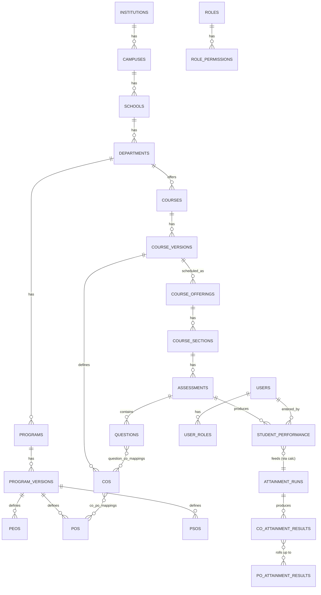
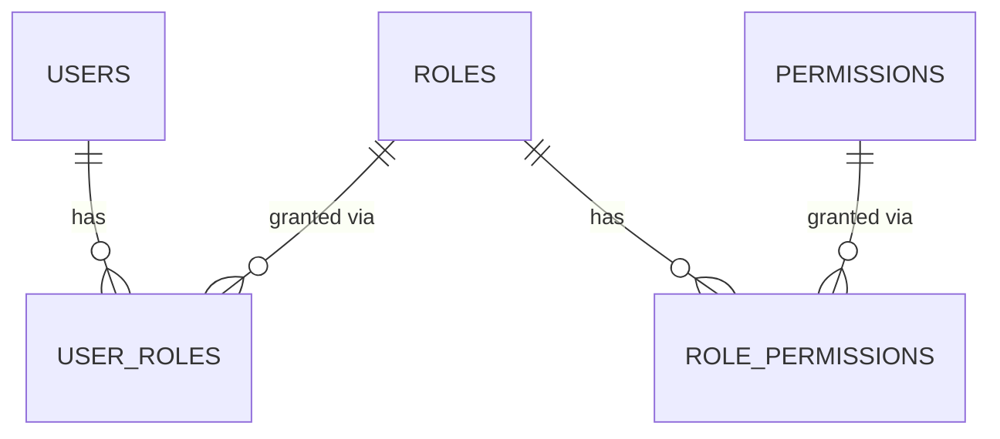

# OBEvolve — Database Plan

PostgreSQL 16. UUID primary keys everywhere. `schema-per-tenant` multi-tenancy —
see [ARCHITECTURE.md](ARCHITECTURE.md) §2 for the mechanism. All tables below live
in each institution's **tenant schema** unless explicitly marked `[public schema]`.

Tables marked **(Phase 1)** are implemented now with real Alembic migrations.
Everything else is the planned schema for later phases — documented up front so
the model doesn't need disruptive rewrites, but not yet migrated.

Conventions used throughout:
- `id UUID PK default gen_random_uuid()`
- `created_at timestamptz default now()`, `updated_at timestamptz` (auto-touched)
- Workflow status columns use one shared enum:
  `draft | submitted | reviewed | approved | published | archived`
- Mapping/weight scores use a configurable scale (see `mapping_scales`), default
  `0=None,1=Low,2=Medium,3=High`
- Soft-delete (`is_active boolean`) only on org/catalog entities that can be
  deactivated; assessment/academic records that feed accreditation are never
  deleted, only superseded by new versions.

---

## 0. Control plane `[public schema]` (Phase 1)

### `institutions`
Tenant registry — the only table every request needs before tenant resolution.

| column | type | notes |
|---|---|---|
| id | uuid PK | |
| name | text | |
| code | text unique | institutional short code |
| slug | text unique | used for subdomain / `X-Institution-Slug` |
| schema_name | text unique | `tenant_<slug>` |
| status | text | `active \| suspended \| trial` |
| subscription_plan | text | |
| contact_email | text | |
| logo_url | text nullable | |
| timezone | text | default `UTC` |
| created_at / updated_at | timestamptz | |

### `platform_admins`
Super Administrator accounts — the only role that spans institutions.

| column | type | notes |
|---|---|---|
| id | uuid PK | |
| email | text unique | |
| password_hash | text | |
| full_name | text | |
| mfa_secret | text nullable | MFA-ready, not enforced yet |
| is_active | boolean | |
| created_at | timestamptz | |

---

## A. Organizational structure (Phase 1)

`institutions → campuses → schools → departments → programs → program_versions`,
plus the academic calendar (`academic_years → academic_terms`).

### `campuses`
`id, institution_id[FK public.institutions], name, code, address, is_active, created_at, updated_at`
*(institution_id is the one cross-schema FK — tenant schema → public schema.)*

### `schools`
`id, campus_id[FK], name, code, is_active, created_at, updated_at`

### `departments`
`id, school_id[FK], name, code, is_active, created_at, updated_at`

### `programs`
`id, department_id[FK], name, code, degree_level, is_active, created_at, updated_at`

### `program_versions`
`id, program_id[FK], version_label, effective_academic_year_id[FK], status(workflow), created_by[FK users], approved_by[FK users], created_at, updated_at`

Historical program versions are never edited after `published`; a new curriculum
change creates a new `program_version` row (spec §6, §10).

### `academic_years`
`id, label, start_date, end_date, is_active`

### `academic_terms`
`id, academic_year_id[FK], name, term_type, start_date, end_date, is_active`

---

## B. Identity & RBAC (Phase 1)

### `users`
`id, email unique, password_hash, full_name, is_active, mfa_enabled, last_login_at, created_at, updated_at`

### `roles`
`id, name, description, is_system_role`  — seeded with the spec §5 defaults, but
institution admins may add custom roles.

### `permissions`
`id, code unique` (e.g. `curriculum.view`, `assessment.approve`, `marks.enter`),
`description, module`

### `role_permissions`
`role_id[FK], permission_id[FK]` — composite PK.

### `user_roles`
`id, user_id[FK], role_id[FK], scope_type` (`institution|campus|school|department|program`),
`scope_id nullable` — lets "HOD" be scoped to one department, "Dean" to one school.

### `faculty_profiles`
`user_id[FK PK], employee_code, designation, department_id[FK]`

### `student_profiles`
`user_id[FK PK], student_code, program_id[FK], program_version_id[FK], batch_year, status`

---

## C. Courses (Phase 2 — planned)

### `courses`
`id, department_id[FK], code, title, description, credits, contact_hours, course_type(core|elective), is_active`

### `course_versions`
`id, course_id[FK], version_label, effective_academic_year_id[FK], status(workflow), created_by[FK], approved_by[FK]`

### `course_prerequisites`
`course_version_id[FK], prerequisite_course_id[FK]`

### `course_offerings`
`id, course_version_id[FK], academic_term_id[FK], program_version_id[FK]`

### `course_sections`
`id, course_offering_id[FK], section_code, max_students`

### `faculty_assignments`
`id, course_section_id[FK], faculty_user_id[FK users], role(coordinator|instructor)`

### `student_enrollments`
`id, student_user_id[FK users], course_section_id[FK], enrollment_status, enrolled_at`

---

## D. OBE outcome hierarchy (Phase 3 — planned)

### `bloom_levels`
`id, name, sequence_order, is_active` — configurable per institution, seeded with
the 6 default levels (Remember → Create).

### `peos` / `pos` / `psos`
Shared shape: `id, program_version_id[FK], code, short_title, statement,
description, is_active, version, target_attainment, status(workflow),
created_by[FK], approved_by[FK], created_at, updated_at`

### `cos`
`id, course_version_id[FK], code, statement, bloom_target_level_id[FK bloom_levels], target_attainment, status(workflow), created_by[FK], approved_by[FK]`

### `tlos`
`id, course_version_id[FK], code, statement, week nullable`

### `competencies`
`id, program_version_id[FK], code, statement`

### `performance_indicators`
`id, competency_id[FK] OR po_id[FK] (one nullable), code, statement`

---

## E. Mappings (Phase 3 — planned)

All normalized junction tables — **never** comma-separated strings or JSON blobs
(spec §7).

| table | columns |
|---|---|
| `peo_po_mappings` | peo_id[FK], po_id[FK], level(int) |
| `po_pso_mappings` | po_id[FK], pso_id[FK], level(int) |
| `co_po_mappings` | co_id[FK], po_id[FK], level(int) |
| `co_pso_mappings` | co_id[FK], pso_id[FK], level(int) |
| `tlo_co_mappings` | tlo_id[FK], co_id[FK], level(int) |
| `competency_pi_mappings` | competency_id[FK], performance_indicator_id[FK], level(int) |

### `mapping_scales`
`id, value(int), label, description` — configurable per institution
(default `0=None,1=Low,2=Medium,3=High`).

---

## F. Assessment (Phase 5 — planned)

### `assessment_types`
`id, name, is_custom`

### `rubrics` / `rubric_criteria` / `rubric_levels`
`rubrics(id, name, description, is_reusable)`
`rubric_criteria(id, rubric_id[FK], criterion, weight)`
`rubric_levels(id, rubric_criterion_id[FK], label, score, description)`

### `questions`
`id, course_version_id[FK], text, question_type, difficulty, marks, topic, status(workflow), author_id[FK users], reviewer_id[FK users], created_at`

### `question_co_mappings` / `question_pi_mappings` / `question_bloom_mappings`
Junction tables: `question_id[FK]` + `co_id[FK]` / `performance_indicator_id[FK]` / `bloom_level_id[FK]`.

### `assessments`
`id, course_section_id[FK], academic_term_id[FK], assessment_type_id[FK], title, max_marks, weight, date, duration_minutes, rubric_id[FK nullable], status(workflow)`

### `assessment_questions`
`assessment_id[FK], question_id[FK], marks_allocated, sequence`

### `lesson_plans`
`id, course_offering_id[FK], week, date, topic, subtopic, tlo_id[FK nullable], co_id[FK nullable], bloom_level_id[FK nullable], teaching_method, learning_activity, resource, planned_duration, actual_duration, delivery_status`

---

## G. Student performance (Phase 5 — planned)

### `student_performance`
Raw marks — **immutable**, never overwritten by attainment calculation.

`id, student_user_id[FK users], assessment_id[FK], question_id[FK nullable],
raw_marks, max_marks, rubric_score nullable, attempt_number, evaluation_status,
entered_by[FK users], entered_at`

Corrections insert a new row (higher `attempt_number`) rather than updating —
history stays intact for audit and accreditation evidence.

---

## H. Attainment engine (Phase 6 — planned)

### `attainment_methodologies`
`id, name, description, version, direct_method, indirect_method, direct_weight,
indirect_weight, thresholds_json, rounding_rule, applicable_program_id[FK
nullable], effective_academic_year_id[FK], is_active`

Institution-configurable — the engine never hard-codes one formula (spec §17–18).

### `attainment_runs`
Immutable calculation record.

`id, methodology_id[FK], methodology_version, program_version_id[FK nullable],
course_version_id[FK nullable], academic_term_id[FK], scope(co|po|pso|peo),
parameters_json, input_dataset_ref, executed_by[FK users], executed_at, status,
calculation_version`

### Result tables (each FK's back to the `attainment_runs` row that produced it)
`co_attainment_results(id, attainment_run_id[FK], co_id[FK], course_section_id[FK], direct_value, indirect_value, final_value, student_count)`
`po_attainment_results`, `pso_attainment_results`, `peo_attainment_results` — analogous, at program scope.
`student_co_attainment(id, attainment_run_id[FK], student_user_id[FK], co_id[FK], value)` — enables the student-level drill-down required by spec §20.

### `threshold_definitions`
`id, scope_type, target, minimum, warning, critical, applicable_program_id[FK nullable]`

---

## I. Continuous improvement (Phase 7 — planned)

### `findings`
`id, related_outcome_type, related_outcome_id, description, root_cause, identified_by[FK users], identified_at, status`

### `action_plans`
`id, finding_id[FK], proposed_action, responsible_user_id[FK users], deadline,
expected_improvement, actual_improvement, evidence_ref nullable,
status(finding|action_plan|implementation|measurement|review|closure)`

---

## J. Surveys (Phase 7 — planned)

`survey_templates(id, name, stakeholder_type, is_anonymous)`
`survey_questions(id, survey_template_id[FK], text, question_type(rating|likert|mcq|text|matrix), options_json, sequence)`
`survey_instances(id, survey_template_id[FK], academic_term_id[FK], program_version_id[FK nullable], opens_at, closes_at, status)`
`survey_responses(id, survey_instance_id[FK], respondent_user_id[FK nullable — anonymous], submitted_at)`
`survey_answers(id, survey_response_id[FK], survey_question_id[FK], answer_value)`

Survey results feed the indirect-attainment side of the attainment engine
(spec §17, §23).

---

## K. Accreditation (Phase 8 — planned)

`accreditation_bodies(id, name, code)`
`accreditation_frameworks(id, accreditation_body_id[FK], name, version)`
`accreditation_criteria(id, framework_id[FK], parent_criterion_id[FK nullable, self-referencing], code, title, description)`
`evidence_requirements(id, criterion_id[FK], description)`
`evidence_items(id, evidence_requirement_id[FK], description, file_ref nullable, url nullable, owner_user_id[FK users], academic_year_id[FK], program_version_id[FK nullable], upload_date, verification_status, reviewer_comments, version)`
`accreditation_submissions(id, framework_id[FK], program_version_id[FK], academic_year_id[FK], status)`

Frameworks are data, not code — NBA/ABET/internal-QA/custom all fit the same
tables (spec §24).

---

## L. Reporting / Analytics (Phase 9 — planned)

Mostly computed from the tables above at read time; the one persisted table:

`report_generation_log(id, report_type, parameters_json, generated_by[FK users], generated_at, file_ref, format)`

---

## M. Audit & operations (Phase 1)

### `audit_logs`
`id, user_id[FK users], action, entity_type, entity_id, previous_value_json,
new_value_json, timestamp, ip_address, user_agent`

Written by the service layer on every significant mutation (outcome changed,
mapping changed, marks changed, assessment approved, attainment calculated,
report generated, evidence uploaded, accreditation criterion approved — spec §29).

### `import_jobs` (Phase 5+ — planned)
`id, import_type, file_ref, status, validation_report_json, rows_total,
rows_success, rows_failed, imported_by[FK users], created_at, completed_at`

### `notifications` (Phase 1 table, Phase 7+ triggers)
`id, user_id[FK users], type, title, body, is_read, created_at`

---

## Core relationship diagram

## RBAC diagram

`user_roles.scope_type/scope_id` (not shown as an FK — polymorphic) ties a role
grant to one campus/school/department/program instead of the whole institution.

---

## Cross-cutting rules

- **UUID PKs** everywhere; `gen_random_uuid()` default (requires `pgcrypto` or
  Postgres 16's built-in `gen_random_uuid()`).
- **Cross-schema FK**: tenant tables referencing `institution_id` point at
  `public.institutions.id` — valid in Postgres within one database, but the one
  place `schema_translate_map` needs an explicit `schema="public"` in the
  SQLAlchemy model.
- **CHECK constraints** on every attainment/percentage column
  (`0 <= value <= 100`, or against the configured target scale).
- **Indexes** on every FK named in spec §32: `institution_id`, `program_id`,
  `course_id`, `academic_year_id`, `term_id`, `student_id`, `assessment_id`,
  `outcome_id` (and their equivalents: `co_id`, `po_id`, etc.).
- **Soft delete** (`is_active`) only on org/catalog entities that can be
  deactivated (courses, programs, users). Academic/assessment records that feed
  accreditation are never physically deleted — only superseded by a new version.
- **Transactions** wrap: assessment imports, marks updates, attainment runs,
  curriculum publication, accreditation submissions (spec §32).
- **Audit logging** happens in the service layer (not scattered across
  endpoints) so every mutating service function that touches the tables above
  also writes an `audit_logs` row.

## Migration strategy

Two independent Alembic chains (see `ARCHITECTURE.md` §2):
- `backend/alembic/public` → `public` schema (`institutions`, `platform_admins`).
- `backend/alembic/tenant` → applied once per `tenant_<slug>` schema via
  `scripts/migrate_all_tenants.py`, using SQLAlchemy `schema_translate_map` so
  the same migration scripts apply unmodified to every tenant.

Phase 1 ships the first migration in each chain (control-plane tables; org
structure + identity/RBAC + audit_logs/notifications). Every later phase adds
new tenant-chain migrations for its table group — never edits Phase 1's
migrations in place.
